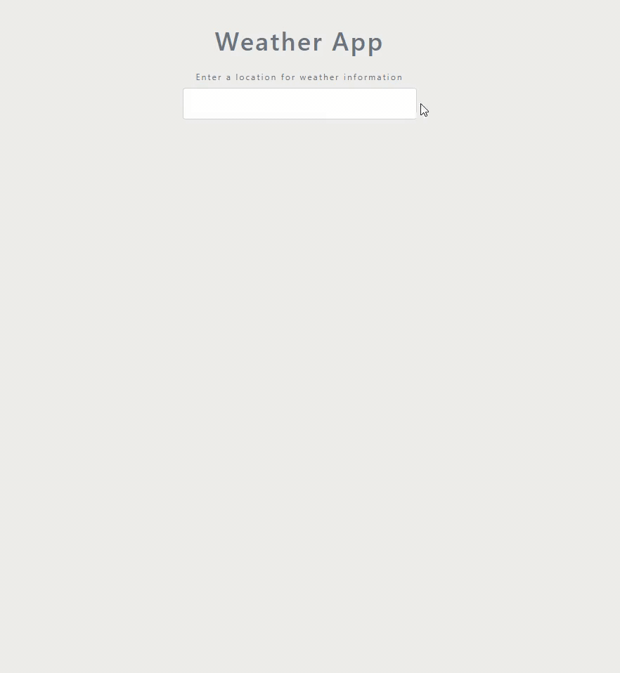
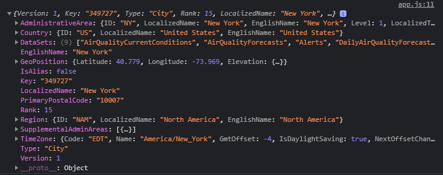

# Weather App
## Overview
A weather application to check the inputted city's current weather by fetching API from [Accuweather](https://developer.accuweather.com/).

---

## Demo


----


## Libraries/Tools
* Bootstrap
* HTML
* CSS
* Javascript
* AccuWeather Locations API
* AccuWeather Current Conditions API


---

## How it works?

### Layout
We're using two divs
* Input for the city
* Information of the weatch

Input/form
```HTML
<!-- Form -->
<form action="" class="change-location my-4 text-center text-muted">
    <label for="city">Enter a location for weather information</label>
    <input type='text' name="city" class="form-control p-4">
</form>

```

Information of the weather will be displayed in a card form so we're using a bootstap's 'card' class.

```HTML 
<!-- Information about the Weather. -->
<div class="card shadow-lg rounded d-none">
    <!-- Img for day or night -->
    
    <div class="icon bg-light mx-auto text-center">
        
    </div>
    <!-- Weather Info -->
    <div class="text-muted text-uppercase text-center details">
        <h5 class="my-5">City Name</h5>
        <div class="my-3">Weather Condition</div>
        <div class="display-4 my-4">
            <span>25</span>
            <span>&deg;C</span>
        </div>
    </div>

</div>
```
Notice the card is set to 'd-none' which is a bootstrap's property of 'display: none', we will be changing this in javascript when the user inputs a city name.

To get started with Javascript we're using two files app.js and forecast.js. Make sure to mention the scripts right above the end of your \<body> tag.
```HTML
<script src="script/app.js"></script>
<script src="script/forecast.js"></script>
```

---

### Setting up your API

Now in order for the APIs to work you need your API key that AccuWeather will provide you when you make an account. Then go to My Apps and Add a new App. After filling out the info you will be provided with your API Key.


Now you can get the APIs required for this app from [here](https://developer.accuweather.com/apis).

Here's the API's we'll be using.

* Locations API, City Search: http://dataservice.accuweather.com/locations/v1/cities/search
* Current Conditions API: http://dataservice.accuweather.com/currentconditions/v1/

---

### Fetching the API data.
Now to fetch the data from the API we'll using two async functions and fetch method. In our forecast.js we'll be implementing this.

```Javascript
// API Key
const key = 'Kmr8fsBplEVH9HwJn2p8pkczcZTb8XHx';

// API Calls
const getCity = async (city) => {

    const baseURL = 'http://dataservice.accuweather.com/locations/v1/cities/search';
    
    const query = `?apikey=${key}&q=${city}`;

    const response = await fetch(baseURL + query);

    const data = await response.json();

    return data[0]
    

}


const getWeather = async (id) => {

    const baseURL = 'http://dataservice.accuweather.com/currentconditions/v1/';
    
    const query = `${id}?apikey=${key}`;

    const response = await fetch(baseURL + query);
    const data = await response.json();

    return data[0]
}

```
Its important to convert our response into json format using json() otherwise array methods cannot be implemented, similarly we're returning the first element of the data using 'data[0]' as sometimes it can return multiple cities of the same name therefore we just need the first element.

---

### DOM Manipulation
Now we can recieve the data from the API depending on the input. So we just have to make changes to the website using DOM Manipulation according to that data in our app.js file.

First things first, call our queries that we need.
```Javascript
const cityForm = document.querySelector('form');
const time = document.querySelector('img.time')
const icon = document.querySelector('.icon img')
const searchList = document.querySelector('.search-list')
```

Our two main functions will be
* UpdateCity, gets the city details and the weather of inputted city and return it in an object.
* UpdateUI, Changes the UI(card) according to the weather of that city.

```Javascript
//Update City
const updateCity = async (city) => {
    const cityDetails = await getCity(city)
    
    const weather = await getWeather(cityDetails.Key)

    return {cityDetails, weather} //shorthand for {cityDetails: cityDetails, weather: weather}

}
```
The 'Key' is the city's ID that is in our cityDetails when we fetched its data. We'll be using cityDetails.EnglishName to display it on our UI as well.

Simlarly we have the weather details and we'll be using *weather.Temperature.Metric.Value* and *weather.WeatherIcon*.


Now to update our UI.

```Javascript
cityForm.addEventListener('submit', (e) => {
    e.preventDefault();

    const city = cityForm.city.value.trim();
    cityForm.reset();

    updateCity(city)
        .then(data => updateUI(data))
        .catch(err => {
            throw new Error('Please enter the correct city name');
        })
    // updateCity(city)
    //     .then(data => updateUI(data))

})

// Update UI

const card = document.querySelector('.card');
const details = document.querySelector('.details');

const updateUI = (data) => {

    // const cityDetails = data.cityDetails;
    // const weather = data.weather;
    // The line below is a shorthand of the two lines of code above.

    const {cityDetails, weather} = data;
    details.innerHTML = `
        <h5 class="my-5">${cityDetails.EnglishName}</h5>
        <div class="my-3">${weather.WeatherText}</div>
        <div class="display-4 my-4">
            <span>${weather.Temperature.Metric.Value}</span>
            <span>&deg;C</span>
        </div>
    `

    // Setting day/night image
    let timeSource = null;

    if (weather.IsDayTime) {
        timeSource = 'img/day.svg'
    } else {
        timeSource = 'img/night.svg'
    }

    time.setAttribute('src', timeSource )

    let iconSource = `img/icons/${weather.WeatherIcon}.svg`
    icon.setAttribute('src', iconSource)

    if (card.classList.contains('d-none')) {
        card.classList.remove('d-none')
    }
    
    
}


```
The icons are stored in the img folder, the API data already has predefined weather icon numbers for every weather we just named all the weather icons in our img folder according to each weather. e.g for a Sunny weather the *weather.WeatherIcon* would be 1 hence '1.svg' from from the img folder will be displayed on our weather card.
```
 let iconSource = `img/icons/${weather.WeatherIcon}.svg`
 ```

 Now to finally implement our event listener to execute everything on Enter when a city is inputted.

 ```Javascript
//On Enter do this
cityForm.addEventListener('submit', (e) => {
    e.preventDefault();

    const city = cityForm.city.value.trim();
    cityForm.reset();

    updateCity(city)
        .then(data => updateUI(data))
        .catch(err => {
            throw new Error('Please enter the correct city name');
        })
    // updateCity(city)
    //     .then(data => updateUI(data))

})


 ```
And you're done.

---

## Source Code
You can download the source code from [here.](https://github.com/asadnmalik/weather-web-app/archive/refs/heads/main.zip)

---
## Copyright, Author
*Copyright 2021*, Asad Naveed Malik, *All rights reserved.*
